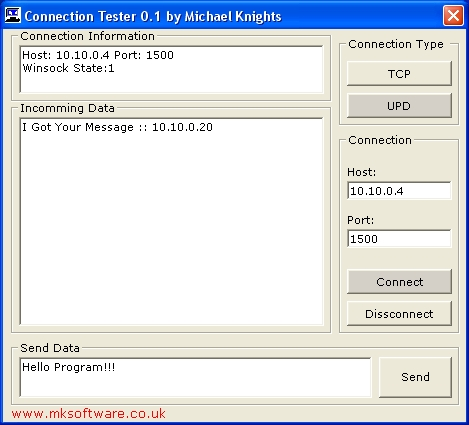



## Connection Tester 0\.1

### Description

This code is design to connect to any server wether TCP or UPD on any port or IP Address. This code woud be useful if you need to check and a server was work or if you wanted to send commands to a winsock or other socket based server. (thoght i doubt anyone will, if you find this code useful please vote Thanks! )
 
### More Info
 

             |
---                |---
**Submitted On**   |1996-08-24 03:06:46
**By**             |[Michael Knights](https://github.com/Planet-Source-Code/PSCIndex/blob/master/ByAuthor/michael-knights.md)
**Level**          |Advanced
**User Rating**    |4.7 (14 globes from 3 users)
**Compatibility**  |VB 4\.0 \(32\-bit\), VB 5\.0, VB 6\.0
**Category**       |[Coding Standards](https://github.com/Planet-Source-Code/PSCIndex/blob/master/ByCategory/coding-standards__1-43.md)
**World**          |[Visual Basic](https://github.com/Planet-Source-Code/PSCIndex/blob/master/ByWorld/visual-basic.md)
**Archive File**   |[Connection19577112192005\.zip](https://github.com/Planet-Source-Code/michael-knights-connection-tester-0-1__1-63708/archive/master.zip)

